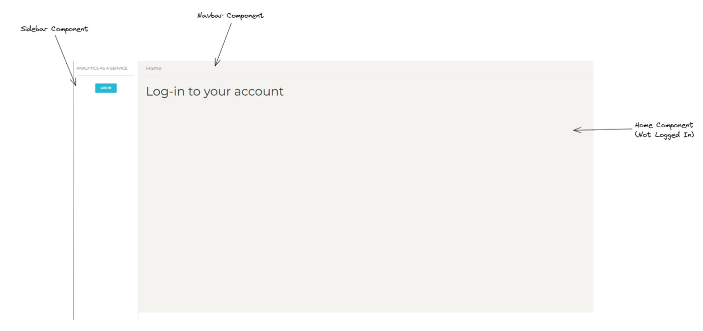
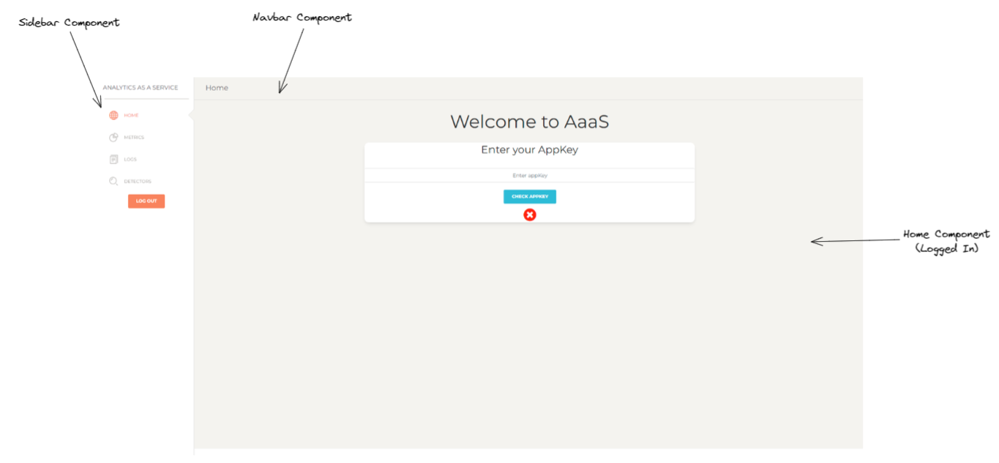
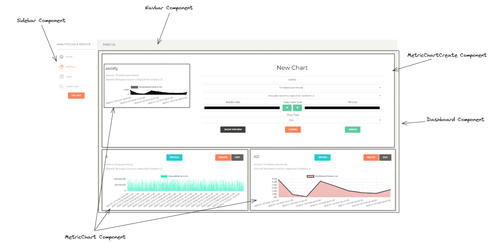
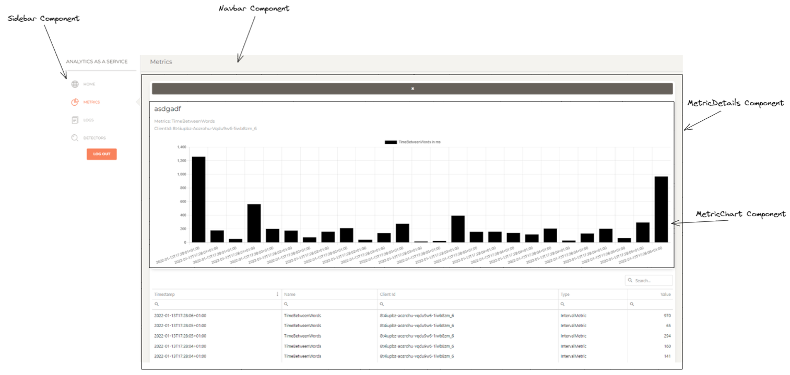
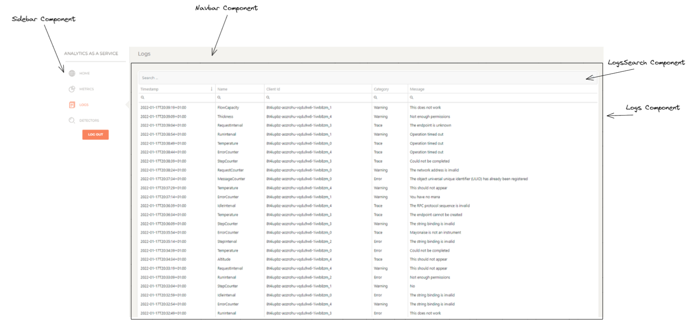
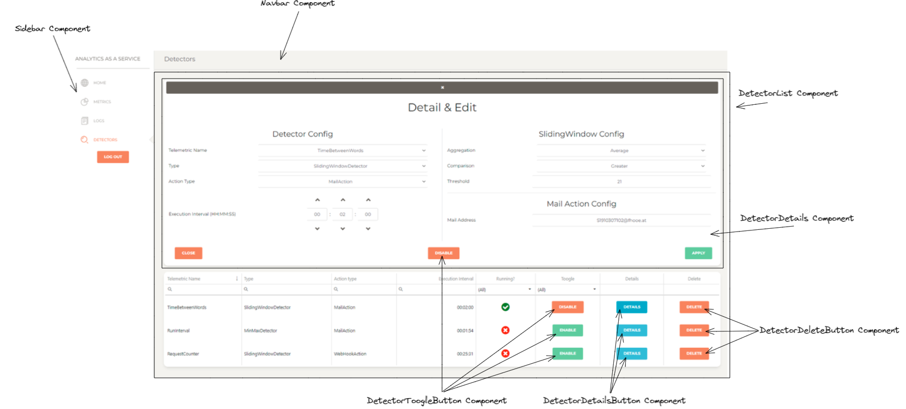

# Installation
This installation guide requires that the Backend is available to the User.

1. Download this project
2. Navigate to the project root
3. Open a CLI
4. Install required packages using `npm install`
5. Run `ng serve` and wait for the process to finish
6. The application is now available on `localhost:4200`

To retrieve data, start the Backend Server by starting the `AaaS.Api`. This project is part of the course SWK project. 

# Overview
The Website is built with different components. In general, the website has a navigation bar (`Sidebar Component`) to the side, which is used to navigate between the main 4 pages:
* Home
* Metrics
* Logs
* Detectors

The top `Navbar Component` always shows the current Page.

## Home Page
### Not Logged in

The user has to log in via an OAuth Server. The `Log In` Button will redirect them to the site.

### Logged in


When logged in, the User has to provide a valid `AppKey` in order to use the other services. All Pages beside `Home` are unavailable until a valid `AppKey` is provided.

## Metrics Page


The `Metric` Page offers an overview to the Users metrics using `Chart.js`.
Charts are stored in the browsers `localstorage`.

### Metric Details


Each chart offers a detailpage, in which the chart is shown in large and all metrics displayed in the chart are shown in a list.
The chart is `scrollable` and `zoomable`.

## Logs


The `Log` Page offers a list of the Users logs. This list has a search-component, which filters the logs for a given string, which is then applied on all fields.
All fields are sortable and filterable on their own.

## Detectors


The `Detector` Page offers a list of the Users detectors. This list is fully sortable and filterable. It offers buttons for:
* Enabling/Disabling the detector
* Deleting the detector
* Opening the detailview of the detector

In the detailview, the properties of the detector can be viewed and changed. 

# Components
## Dashboard
```html
<dashboard-cmp></dashboard-cmp>
```

## Metric Chart
```html
<app-metric-chart [chartInfo]="..." [showButtons]="..." 
            (deleteChartEvent)="..." (openDetailsEvent)="..." (editChartEvent)="...">
</app-metric-chart>
```

* [chartInfo]: Information for the chart, see `Metric Chart`
* [showButtons]: bool, whether the buttons of the chart should be shown
* (deleteChartEvent): EventEmitter that emits when the `delete` button is pressed and sends the `chartInfo` of the chart this Event belongs to
* (openDetailsEvent): EventEmitter that emits when the `details` button is pressed
* (editChartEvent): EventEmitter that emits when the `edit` button is pressed and sends the `chartInfo` of the chart this Event belongs to

## Metric Chart Create
```html
<app-metric-chart-create [chartInfo]="..." 
                (editEvent)="..." (createdEvent)="..." (cancelCreateEvent)="...">
</app-metric-chart-create>
```

* [chartInfo]: Information for the chart, if this component is used to edit a chart, see `Metric Chart`
* (editEvent): EventEmitter that emits when the `edit` button of this component is pressed and sends the name of the chart before the edit and the new `chartInfo` for that chart
* (createdEvent): EventEmitter that emits when the `create` button of this component is pressed and sends the `chartInfo` of the chart created
* (cancelCreateEvent): EventEmitter that emits when the `cancel` button of this component is pressed

## Metric Details
```html
<app-metric-details [chartInfo]="..." [metrics]="..."
                (closeEvent)="...">
</app-metric-details>
```

* [chartInfo]: Information for the chart, see `Metric Chart`
* [metrics]: List of metrics for the chart
* (closeEvent): EventEmitter that emits when the `x` button of this component is pressed

## Logs
```html
<logs-cmp></logs-cmp>
```

## Logs Search
```html
<app-logs-search (logsFetched)="..."></app-logs-search>
```

* (logsFetched): EventEmitter that emits when this component has retrieved a filtered list of logs and sends these logs

## Detector List
```html
<app-detector-list></app-detector-list>
```

## Detector Toogle Button
```html
<app-detector-toggle-button [detectorId]="..." [state]="..."
          (toggledEventEmitter)="...">
</app-detector-toggle-button>
```

This button is used to enable/disable a detector.
* [detectorId]: Id of the detector that this button refers to
* [state]: bool that tells the initial state of this button
* (toogledEventEmitter): EventEmitter that emits when the button is pressed and sends the id of the detector and the new state

## Detector Details Button
```html
<app-detector-details-button [detectorId]="..." 
            (openDetailsEventEmitter)="...">
</app-detector-details-button>
```

* [detectorId]: Id of the detector that this button refers to
* (openDetailsEventEmitter): EventEmitter that emits when the button is pressed and sends the id of the detector

## Detector Delete Button
```html
<app-detector-details-button [detectorId]="..." 
            (deleteEventEmitter)="...">
</app-detector-details-button>
```

* [detectorId]: Id of the detector that this button refers to
* (deleteEventEmitter): EventEmitter that emits when the button is pressed and sends the id of the detector

## Detector Details
```html
<app-detector-details [detector]="..."
                        (closeEventEmitter)="..."
                        (editedEventEmitter)="..."
                        (createdEventEmitter)="...">
</app-detector-details>
```

This component is used as a detailpage, for editing and for creating a detector.
* [detector]: Detector that is displayed in this component, can be ignored if the component is used to create a new detector
* (closeEventEmitter): EventEmitter that emits when the `close` button is pressed
* (editedEventEmitter): EventEmitter that emits when the `apply` button is pressed and sends the updated detector
* (createdEventEmitter): EventEmitter that emits when the `create` button is pressed and sends the created detector